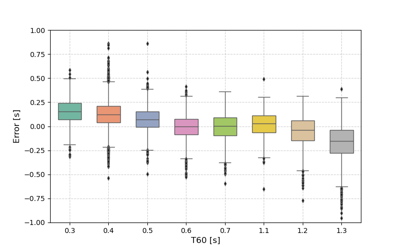

# CRNN-T60-Estimation

This repository is an unofficial PyTorch implementation of the paper:
**"Online Blind Reverberation Time Estimation Using CRNNs"** (Interspeech 2020) [1].
The model estimates the reverberation time ($T_{60}$) directly from raw speech waveforms using a CRNN (Convolutional Recurrent Neural Network) architecture with Gammatone-based features.


*(Result on ACE Eval Dataset: Prediction Error vs Ground Truth T60)*
*Figure: Prediction Error vs Ground Truth T60 on the ACE Eval Dataset.*

## 📌 Features
* **End-to-End Learning**: Directly estimates $T_{60}$ from raw waveforms using Gammatone-based features.
* [cite_start]**Hybrid Architecture**: Combines CNN for feature extraction and LSTM for temporal context modeling[cite: 36].
* **Robustness**: Optimized training strategy with data augmentation (random cropping, noise injection) to handle variable input lengths.

## 🚀 Performance
Evaluation on the **ACE Challenge Eval Dataset** (Samples with duration $\ge$ 4s).

| Metric | Implementation | Paper Baseline (CNN) [2] | Paper Proposed (CRNN) [1] |
| :--- | :---: | :---: | :---: |
| **MSE** | **0.0340** | 0.0384 | 0.0206 |
| **Bias** | **0.0501** | 0.0304 | -0.0488 |
| **PCC** | **0.8469** | 0.836 | 0.917 |

> **Note:**
> * The model was trained purely on **synthetic RIRs** generated using the [Image Method](https://github.com/ehabets/RIR-Generator) (RIR Generator).
> * The oracle reverberation time ($T_{60}$) for training labels was calculated using the method by Karjalainen et al. (Estimation of modal decay parameters from noisy response measurements).

## 🛠️ Installation

1. Clone the repository:
   ``` bash git clone [https://github.com/PoHsuChen/CRNN-T60-Estimation.git](https://github.com/PoHsuChen/CRNN-T60-Estimation.git) cd CRNN-T60-Estimation ```
2. Install dependencies:
    ```bash pip install -r requirements.txt```
## 📂 Dataset Preparation
This implementation uses the ACE Challenge Dataset for evaluation.
* Training: Synthetic RIRs convolved with LibriSpeech (simulated dynamically or pre-generated).
* Testing: ACE Eval Dataset
Please update the paths in utils.py:
```python
# src/utils.py
TRAIN_CSV_PATH = "./path/to/your/synthetic/metadata.csv"
TEST_ROOT_DIR = "./path/to/ACE_Eval_dataset/Eval/Speech"
```

## ▶️ Usage
Training
```python main.py```


## 📜 Citation
If you find this code useful, please cite the original paper:
```bibtex
@inproceedings{deng2020online,
  title={Online Blind Reverberation Time Estimation Using CRNNs},
  author={Deng, Shuwen and Mack, Wolfgang and Habets, Emanuel AP},
  booktitle={Proc. Interspeech 2020},
  pages={5061--5065},
  year={2020}
}```
[1] S. Deng, W. Mack and E. A. P. Habets, "Online Blind Reverberation Time Estimation Using CRNNs," Proc. Interspeech 2020, pp. 5061-5065, 2020.

[2] H. Gamper and I. J. Tashev, "Blind reverberation time estimation using a convolutional neural network," Proc. IWAENC, 2018.
